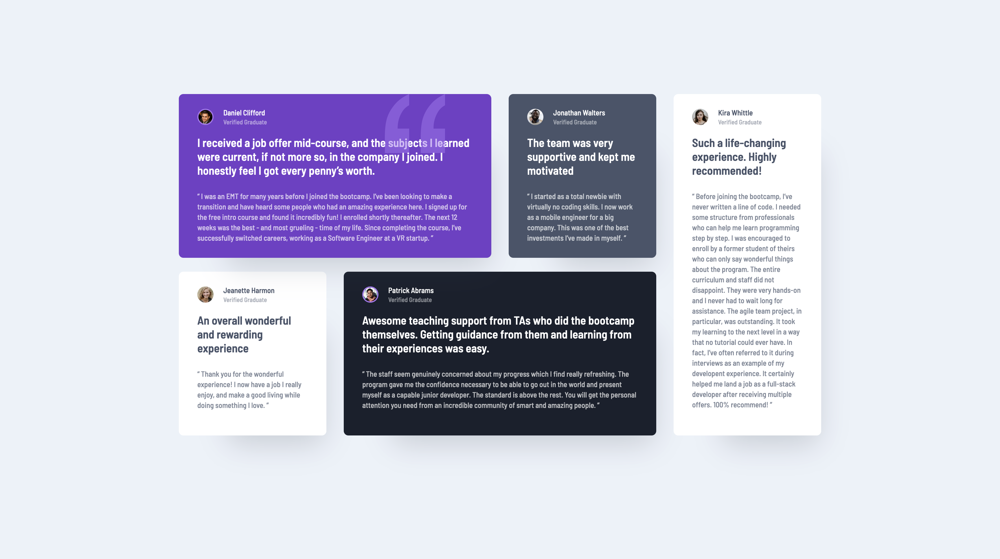

# Frontend Mentor - Testimonials grid section solution

This is a solution to the [Testimonials grid section challenge on Frontend Mentor](https://www.frontendmentor.io/challenges/testimonials-grid-section-Nnw6J7Un7). Frontend Mentor challenges help you improve your coding skills by building realistic projects.

## Table of contents

- [Overview](#overview)
  - [The challenge](#the-challenge)
  - [Screenshot](#screenshot)
  - [Links](#links)
- [My process](#my-process)
  - [Built with](#built-with)
  - [What I learned](#what-i-learned)
- [Author](#author)

## Overview

### The challenge

Users should be able to:

- View the optimal layout for the site depending on their device's screen size

### Screenshot

### Links

- Solution URL: [https://github.com/Oliko136/testimonials-grid-section](https://github.com/Oliko136/testimonials-grid-section)
- Live Site URL: [https://oliko136.github.io/testimonials-grid-section/](https://oliko136.github.io/testimonials-grid-section/)

## My process

### Built with

- Semantic HTML5 markup
- CSS custom properties
- Flexbox
- CSS Grid
- Mobile-first workflow

### What I learned

This challenge allowed me to practice CSS Grid basics.

## Author

- Frontend Mentor - [@Oliko136](https://www.frontendmentor.io/profile/Oliko136)
- LinkedIn - [@olha-sliusarenko](https://www.linkedin.com/in/olha-sliusarenko/)
- X - [@committedto_git](https://x.com/committedto_git)
